# Idea Development Pipeline Flow

This pipeline processes ideas from initial research through requirements validation.

## Pipeline Configuration
- **Template**: `idea_development`
- **Workflow Type**: `sequential`
- **Workspace**: `discussions`
- **Discussion Category**: `Ideas`

## Flow Diagram

```mermaid
flowchart TD
    Start([GitHub Discussion Created]) --> TaskQueue[Task Queue Enqueue]

    TaskQueue --> ValidateTask{Validate Task<br/>Can Run?}

    ValidateTask -->|Dev Container Required| CheckDevContainer{Dev Container<br/>Verified?}
    CheckDevContainer -->|No| QueueDevSetup[Queue dev_environment_setup]
    QueueDevSetup --> WaitSetup[Wait for Setup]
    WaitSetup --> ValidateTask
    CheckDevContainer -->|Yes| ProceedTask

    ValidateTask -->|No Dev Container Needed| ProceedTask[Proceed with Task]

    ProceedTask --> Stage1Start[Stage 1: Research]

    subgraph DockerResearch["Docker Container: clauditoreum-orchestrator:latest"]
        Stage1Start --> CreateResearchAgent[Create idea_researcher AgentStage]
        CreateResearchAgent --> BuildResearchPrompt[Build Prompt from Discussion]
        BuildResearchPrompt --> RunResearchClaude[Run Claude Code in Container]
        RunResearchClaude --> ResearchOutput[Stream JSON Output]
        ResearchOutput --> PostResearchComment[Post Analysis to Discussion]
    end

    PostResearchComment --> CheckResearchQuality{Quality Gates<br/>Met?}

    CheckResearchQuality -->|research_depth < 0.6<br/>OR feasibility_confidence < 0.5| RetryResearch{Retries<br/>< 2?}
    RetryResearch -->|Yes| Stage1Start
    RetryResearch -->|No| FailPipeline[Circuit Breaker Opens]

    CheckResearchQuality -->|Pass| Stage2Start[Stage 2: Business Analysis]

    subgraph DockerAnalysis["Docker Container: clauditoreum-orchestrator:latest (Read-Only FS)"]
        Stage2Start --> CreateBAAgent[Create business_analyst AgentStage]
        CreateBAAgent --> BuildBAPrompt[Build Prompt with Research Context]
        BuildBAPrompt --> RunBAClaude[Run Claude Code in Container]
        RunBAClaude --> BAOutput[Stream JSON Output]
        BAOutput --> PostBAComment[Post Requirements to Discussion]
    end

    PostBAComment --> CheckBAQuality{Quality Gates<br/>Met?}

    CheckBAQuality -->|completeness_score < 0.6<br/>OR clarity_score < 0.6| RetryBA{Retries<br/>< 3?}
    RetryBA -->|Yes| Stage2Start
    RetryBA -->|No| FailPipeline

    CheckBAQuality -->|Pass| Stage3Start[Stage 3: Requirements Review]

    subgraph DockerReview["Docker Container: clauditoreum-orchestrator:latest (Read-Only FS)"]
        Stage3Start --> CreateReviewerAgent[Create requirements_reviewer AgentStage]
        CreateReviewerAgent --> BuildReviewPrompt[Build Review Prompt with BA Output]
        BuildReviewPrompt --> RunReviewClaude[Run Claude Code in Container]
        RunReviewClaude --> ReviewOutput[Stream JSON Output]
        ReviewOutput --> ParseReview[Parse Review Status]
    end

    ParseReview --> PostReviewComment[Post Review to Discussion]
    PostReviewComment --> CheckReviewQuality{Quality Gates<br/>Met?}

    CheckReviewQuality -->|validation_score < 0.7<br/>OR accuracy_score < 0.7| RetryReview{Retries<br/>< 2?}
    RetryReview -->|Yes| Stage3Start
    RetryReview -->|No| FailPipeline

    CheckReviewQuality -->|Pass| CompletePipeline[Pipeline Complete]

    FailPipeline --> LogFailure[Log Stage Failure]
    CompletePipeline --> LogSuccess[Log Stage Completion]

    LogSuccess --> End([End])
    LogFailure --> End

    style DockerResearch fill:#e3f2fd
    style DockerAnalysis fill:#fff3e0
    style DockerReview fill:#f3e5f5
    style FailPipeline fill:#ffebee
    style CompletePipeline fill:#e8f5e9
```

## Key Implementation Details

### Container Isolation
- **Research Agent**: Runs in `clauditoreum-orchestrator:latest` with read-write filesystem
- **Business Analyst Agent**: Runs in `clauditoreum-orchestrator:latest` with **READ-ONLY** filesystem (filesystem_write_allowed: false)
- **Requirements Reviewer Agent**: Runs in `clauditoreum-orchestrator:latest` with **READ-ONLY** filesystem (filesystem_write_allowed: false)

### Data Flow
1. All agents receive context through `pipeline_context['context']`
2. Each stage's output is passed to next stage via `previous_stage_output`
3. All outputs are posted as GitHub Discussion comments, not files

### Circuit Breaker Pattern
- Each stage has a circuit breaker with failure threshold = 3
- After 3 consecutive failures, circuit opens and pipeline halts
- State is persisted to allow recovery from checkpoints

### State Management
- Pipeline creates checkpoint before each stage execution
- On failure, pipeline can resume from last checkpoint
- State stored in `orchestrator_data/state/`

### Observability
- Real-time streaming via Redis pub/sub (`orchestrator:claude_stream`)
- Events emitted: task_received, agent_initialized, claude_call_started, claude_call_completed, agent_completed
- Stream history kept in Redis Stream with 500 entry limit and 2-hour TTL
