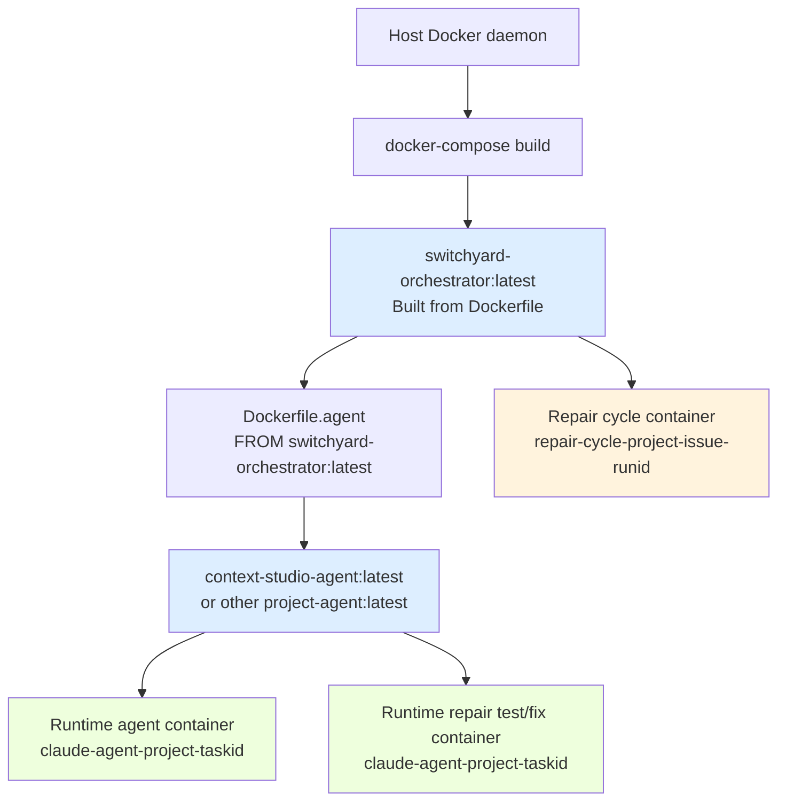
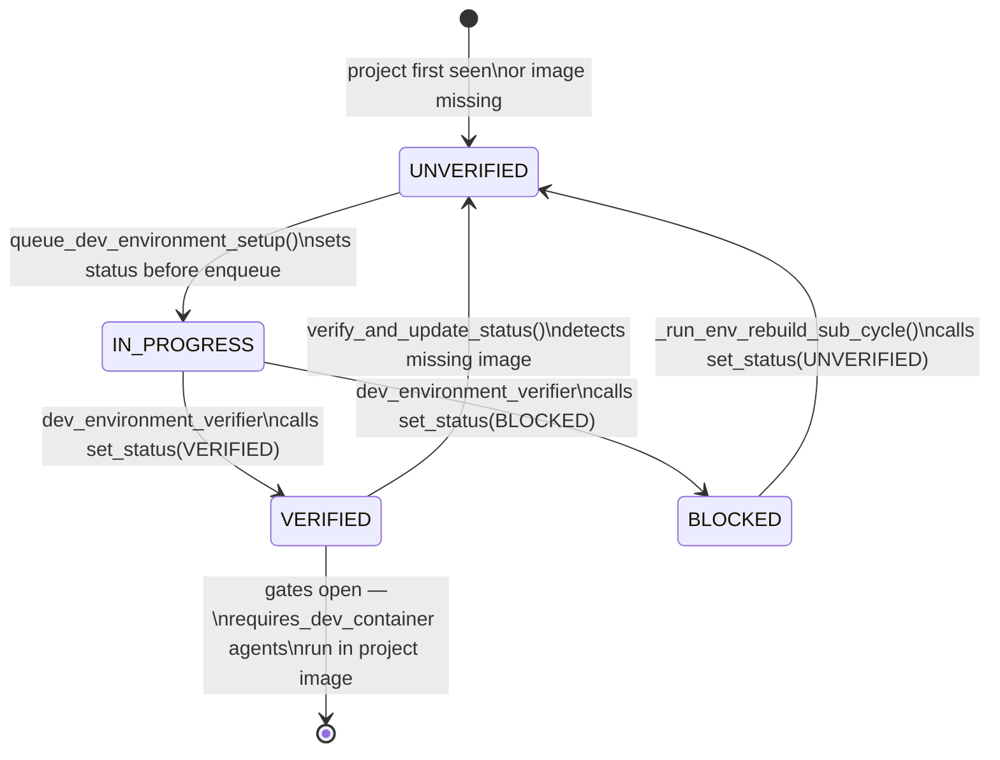
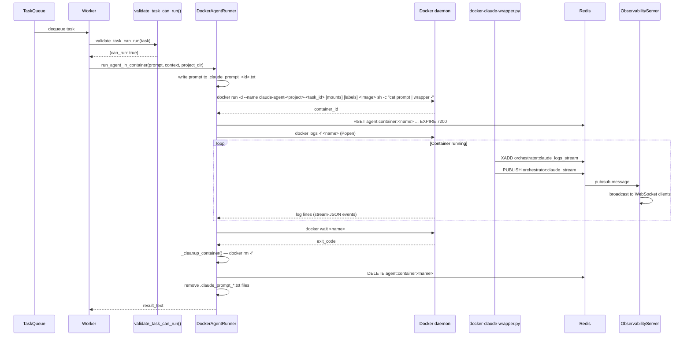
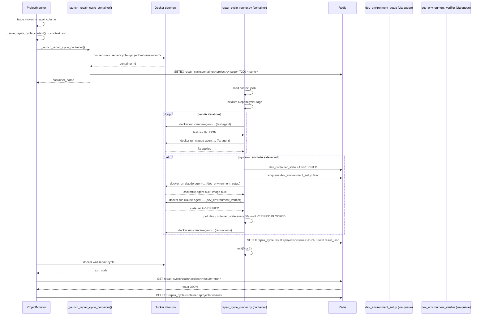
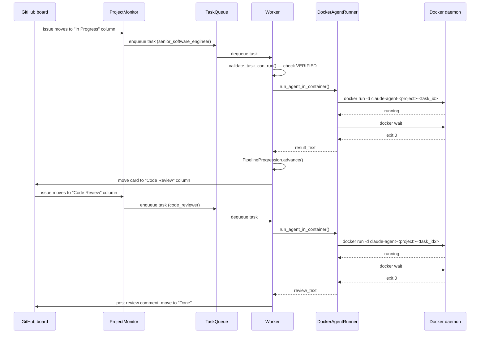

# Containerization strategy and Docker image lifecycle

This document describes how the switchyard orchestrator builds, manages, and executes Docker containers across all runtime contexts: the orchestrator itself, Claude Code agent containers, and repair cycle containers.

## Contents

1. [Three-tier image hierarchy](#1-three-tier-image-hierarchy)
2. [Mount strategy](#2-mount-strategy)
3. [Dev-environment-setup agent lifecycle](#3-dev-environment-setup-agent-lifecycle)
4. [Repair cycle re-invocation of dev-environment-setup](#4-repair-cycle-re-invocation-of-dev-environment-setup)
5. [Agent container lifecycle for a single pipeline stage](#5-agent-container-lifecycle-for-a-single-pipeline-stage)
6. [Repair cycle container — a special case](#6-repair-cycle-container--a-special-case)

---

## 1. Three-tier image hierarchy

The system uses three distinct image layers. Each layer builds on the previous one and adds project-specific context.

### Tier 1: `switchyard-orchestrator:latest`

Built from `/home/austinsand/workspace/orchestrator/switchyard/Dockerfile` using `docker-compose build` or `docker compose build`. This image serves two roles: it runs the orchestrator process itself, and it is the base `FROM` layer for every project's agent image.

What it contains:

- Python 3.11-slim base
- Node.js v22.20.0 and `npm`
- `@anthropic-ai/claude-code` and `@playwright/mcp` installed globally via `npm`
- `git`, `curl`, `gnupg2`, `procps` (the `procps` package provides `ps`, which Claude CLI requires)
- GitHub CLI (`gh`)
- Docker CLI (`docker-ce-cli`) — needed by `dev_environment_setup` to build agent images
- Python packages from `requirements.txt`
- Playwright native library dependencies (libnss3, libatk-bridge2.0-0, libdrm2, libxkbcommon0, libgbm1, libasound2)
- Global `git config --system` with safe directory `*`
- A non-root user `orchestrator` at UID 1000. When `DOCKER_GID != 0` (Linux), a `docker` group is created with that GID and the user is added to it. When `DOCKER_GID=0` (macOS), the user is added to the `root` group instead. The `DOCKER_GID` build arg defaults to 984.
- The Claude Code wrapper script at `/app/scripts/docker-claude-wrapper.py` (executable)
- Claude Code plugins installed to the `orchestrator` user's home directory

The `DOCKER_GID` build arg allows the host's Docker socket GID to be matched inside the container, granting `orchestrator` access to `/var/run/docker.sock` without running as root.

### Tier 2: `<project>-agent:latest`

Built by the `dev_environment_setup` agent during project onboarding, using a `Dockerfile.agent` in the project repository root. The canonical build command is:

```bash
docker build -f /workspace/<project>/Dockerfile.agent -t <project>-agent:latest /workspace/<project>
```

Every `Dockerfile.agent` begins with:

```dockerfile
FROM switchyard-orchestrator:latest
```

This means the project image inherits everything from tier 1 — Claude CLI, git, gh CLI, Python, procps — and then adds project-specific runtimes and pre-installed dependencies on top.

The concrete example at `/home/austinsand/workspace/orchestrator/context-studio/Dockerfile.agent` adds:
- Node.js 22.x via nodesource
- System dependencies for SQLite extensions and Tauri (build-essential, libssl-dev, libwebkit2gtk-4.1-dev, etc.)
- Pre-installed npm dependencies for the `ux/` and `app/` subdirectories (copied from package manifests, not from source)
- Global npm tools: prettier, eslint, typescript
- An `orchestrator` user at UID 1000/GID 1000

The image does not copy source code. Source code arrives at runtime via volume mount. Only dependency manifests (package.json, requirements.txt, etc.) are copied during build so that `npm ci` or `pip install` can pre-populate the package cache.

The `Dockerfile.agent` pattern has six stages:

| Stage | Purpose |
|---|---|
| 1 | `FROM switchyard-orchestrator:latest` — inherit base tooling |
| 2 | Install project-specific runtimes (Node.js, Java, etc.) |
| 3 | Pre-install dependencies from manifests (optional but recommended) |
| 4 | Fix ownership of installed paths (not source — that comes from the mount) |
| 5 | `USER orchestrator` — switch to non-root |
| 6 | Verify claude, git, and gh are present (`RUN claude --version && git --version && gh --version`) |

### Tier 3: Runtime agent containers

These are ephemeral containers created by `DockerAgentRunner.run_agent_in_container()` for each pipeline stage execution. They use the tier 2 project image (or fall back to tier 1 if the project image is not yet verified). They run with `--rm` and are cleaned up after each agent invocation.

### Build flow



---

## 2. Mount strategy

### Orchestrator container mounts (from `docker-compose.yml`)

The `orchestrator` service defines these volume mounts:

| Host path | Container path | Mode | Purpose |
|---|---|---|---|
| `./` (switchyard/) | `/app` | rw | Orchestrator application code; `WORKDIR /app` |
| `..` (orchestrator/) | `/workspace` | rw | Workspace root containing all project checkouts |
| `~/.ssh/id_ed25519` | `/home/orchestrator/.ssh/id_ed25519` | ro | SSH key for git operations |
| `~/.gitconfig` | `/home/orchestrator/.gitconfig` | rw | Git identity and settings |
| `~/.orchestrator` | `/home/orchestrator/.orchestrator` | rw | GitHub App private keys |
| `/var/run/docker.sock` | `/var/run/docker.sock` | rw | Docker socket for container operations |

The `/workspace` mount makes all managed project checkouts visible inside the orchestrator container at `/workspace/<project>/`. The separate `/app` mount (which is the same `switchyard/` directory) allows the orchestrator code to be used at its natural path without going through `/workspace/switchyard/`.

### Agent container mounts (assembled by `_build_docker_command()` in `docker_runner.py`)

For each agent container, the orchestrator assembles a `docker run` command with these mounts:

| Mount spec | Container path | Mode | Purpose |
|---|---|---|---|
| `$HOST_PROJECT_PATH` | `/workspace` | rw or ro | Project source code; mode set per `filesystem_write_allowed` in `agents.yaml` |
| `$HOST_HOME/.ssh` | `/home/orchestrator/.ssh` | ro | SSH key for git push/pull inside the agent |
| `$HOST_HOME/.gitconfig` | `/home/orchestrator/.gitconfig` | rw | Git identity |
| `$HOST_WORKSPACE/switchyard/scripts/docker-claude-wrapper.py` | `/app/scripts/docker-claude-wrapper.py` | ro | Redis event writer (see section 5) |
| `$HOST_MCP_CONFIG` | `/home/orchestrator/.mcp_config.json` | ro | Task-specific MCP server config (if any) |
| `/var/run/docker.sock` | `/var/run/docker.sock` | rw | Docker socket — only for `dev_environment_setup` agent |

The workspace is mounted read-write when `filesystem_write_allowed: true` in `agents.yaml`, and read-only otherwise. Agents that only post reviews to GitHub (code_reviewer, software_architect, etc.) use read-only mounts.

The Docker socket is mounted only for `dev_environment_setup`. This agent needs to execute `docker build` inside its container to build the project's `Dockerfile.agent`. All other agents have no Docker socket access.

SSH is mounted read-only because agents only need to authenticate with GitHub — they must not modify the host SSH configuration.

### `HOST_HOME` and `/proc/self/mountinfo`

The orchestrator needs to provide host filesystem paths to `docker run -v` commands, because it is itself inside a container and Docker-in-Docker mounts must use paths valid on the host daemon.

`DockerAgentRunner._detect_host_home_path()` reads the `HOST_HOME` environment variable, which must be set explicitly in `.env` (for example, `HOST_HOME=/home/youruser`). If not set, it falls back to the container's `$HOME` variable and logs a warning, because the container's `$HOME` is almost certainly wrong for Docker-in-Docker SSH mounts.

`DockerAgentRunner._detect_host_workspace_path()` reads `/proc/self/mountinfo` to find the host filesystem path that is bind-mounted to `/workspace` inside the orchestrator container. If `/proc/self/mountinfo` parsing fails, it falls back to the `HOST_WORKSPACE_PATH` environment variable. This avoids the Snap Docker problem where `$HOME` resolves to a snap-versioned path (`/home/user/snap/docker/<rev>/`) that does not contain the actual SSH configuration.

The need for explicit `HOST_HOME` (rather than pure `/proc/self/mountinfo` inference) is that Snap Docker routes SSH bind-mounts through its internal namespace paths, so `/proc/self/mountinfo` would return a Snap path for `~/.ssh`. The `.env.example` file documents this requirement.

---

## 3. Dev-environment-setup agent lifecycle

### When it is triggered

At orchestrator startup, `main.py` calls `workspace_manager.initialize_all_projects()`, which checks each configured project for two conditions:

1. The project was freshly cloned (no local checkout existed).
2. `Dockerfile.agent` does not exist in the project directory.

If either condition is true, `main.py` additionally calls `dev_container_state.verify_and_update_status()` to confirm that a previously verified Docker image still exists locally. If the image is missing (for example, after a `docker system prune`), the project is also marked as needing setup.

For every project that needs setup, `main.py` enqueues a `dev_environment_setup` task at `TaskPriority.HIGH` with `context['automated_setup'] = True`.

### What `dev_environment_setup` does

The `DevEnvironmentSetupAgent` extends `MakerAgent`. It runs in the orchestrator container itself (not in a project agent container), because it must have access to Docker to build the image. It is the only agent with `requires_docker: false` and `requires_dev_container: false` in `agents.yaml`.

The agent's instructions (`get_initial_guidelines()`) direct it to:

1. Inspect the project codebase to identify tech stacks and dependency files.
2. Create or fix `Dockerfile.agent` following the six-stage pattern described in section 1.
3. Build the image: `docker build -f /workspace/<project>/Dockerfile.agent -t <project>-agent:latest /workspace/<project>`
4. Test the image by running `docker run --rm <project>-agent:latest claude --version`, `git --version`, and `gh --version`.
5. Run any project-specific smoke tests.

### `DevContainerStateManager` and state files

State is stored in YAML files at `/app/state/dev_containers/<project>.yaml` (the `ORCHESTRATOR_ROOT` environment variable controls the base path; it defaults to `/app`). The `DevContainerStateManager` class in `services/dev_container_state.py` manages these files.

Each file contains:

```yaml
status: verified        # or: unverified, in_progress, blocked
image_name: context-studio-agent:latest
updated_at: 2026-03-15T12:00:00
```

The `DevContainerStatus` enum has four values:

| Value | Meaning |
|---|---|
| `UNVERIFIED` | Default for new projects; no image verified |
| `IN_PROGRESS` | `dev_environment_setup` agent is currently running |
| `VERIFIED` | Image built, tested, and confirmed working |
| `BLOCKED` | Unable to produce a working image |

`queue_dev_environment_setup()` in `agents/orchestrator_integration.py` is idempotent: it checks the current status first and returns early without re-queuing if the status is already `IN_PROGRESS`. When it does queue the task, it sets the status to `IN_PROGRESS` before enqueuing, so any concurrent caller sees `IN_PROGRESS` and skips.

### `dev_environment_verifier` agent

After `dev_environment_setup` completes, the pipeline runs `DevEnvironmentVerifierAgent`. This agent extends `PipelineStage` and runs in the orchestrator container (also `requires_dev_container: false`).

The verifier's prompt directs it to:

1. Run `docker images <project>-agent:latest` to confirm the image exists.
2. Execute `docker run --rm <project>-agent:latest claude --version`, `git --version`, and `gh --version`.
3. Run project-specific runtime checks.
4. Call `dev_container_state.set_status()` in Python code with `DevContainerStatus.VERIFIED` on success or `DevContainerStatus.BLOCKED` on failure.

The verifier also parses its own output for a `### Status` line containing `**APPROVED**` or `**BLOCKED**`. If found, it calls `set_status()` again from the verifier's Python code (outside the agent prompt) to ensure the state is set even if the agent's in-prompt code had an issue.

### How the verified state gates task dispatch

`validate_task_can_run()` in `agents/orchestrator_integration.py` is called by the task worker before dispatching any task:

```python
status = dev_container_state.get_status(task.project)
if status == DevContainerStatus.VERIFIED:
    return {'can_run': True, ...}
elif status == DevContainerStatus.IN_PROGRESS:
    return {'can_run': False, 'defer': True, ...}
elif status == DevContainerStatus.BLOCKED:
    return {'can_run': False, ...}
else:  # UNVERIFIED
    return {'can_run': False, 'needs_dev_setup': True}
```

`_get_image_for_agent()` in `docker_runner.py` separately checks `dev_container_state.is_verified(project)` before deciding which Docker image to use for a container launch. If the status is not `VERIFIED`, the agent falls back to `switchyard-orchestrator:latest`.

### State transitions



---

## 4. Repair cycle re-invocation of dev-environment-setup

### When the repair cycle detects an environmental failure

`RepairCycleStage._run_test_cycle()` calls `_analyze_systemic_failures()` the first time failures are observed for a given test type. The analysis prompt asks Claude to classify whether failures indicate:

- `has_env_issues`: missing dependencies, wrong Python version, unavailable CLI tools, import errors
- `has_systemic_code_issues`: architectural code problems spanning multiple files

If `has_env_issues` is true, `_run_env_rebuild_sub_cycle()` is invoked.

### `_run_env_rebuild_sub_cycle()`

This method (in `pipeline/repair_cycle.py`) loops up to `MAX_SYSTEMIC_SUB_CYCLES` times (currently 3). Each iteration:

1. Calls `dev_container_state.set_status(project, DevContainerStatus.UNVERIFIED, error_message=...)` to clear the current verified state.
2. Calls `queue_dev_environment_setup(project, logger, change_description=analysis.env_issue_description, pipeline_run_id=pipeline_run_id)` from `agents/orchestrator_integration.py`. This sets the status to `IN_PROGRESS` and enqueues a new `dev_environment_setup` task with the specific error description injected into the task context.
3. Polls `dev_container_state.get_status(project)` every 30 seconds until the status reaches `VERIFIED` or `BLOCKED`. There is no fixed poll timeout — the 1-hour stall check in `_monitor_repair_cycle_container()` (in `services/project_monitor.py`) handles runaway cases.
4. If `VERIFIED`: runs tests again via `_run_tests()`. If tests pass, exits the sub-cycle. If still failing, repeats (up to `MAX_SYSTEMIC_SUB_CYCLES`).
5. If `BLOCKED`: logs a warning and breaks out of the sub-cycle. An `ERROR_ENCOUNTERED` event is emitted only if the setup call raises an exception, not on a normal `BLOCKED` outcome.

The sub-cycle returns the last `RepairTestResult`, so `_run_test_cycle()` does not need to run an additional test pass.

---

## 5. Agent container lifecycle for a single pipeline stage

### Pre-launch: `validate_task_can_run()`

Before dispatching any task, the worker calls `validate_task_can_run()`. If the agent has `requires_dev_container: true` in `agents.yaml` and the project's dev container status is not `VERIFIED`, the task is deferred or rejected. This prevents agents like `senior_software_engineer` from launching against a project whose image does not exist.

### `DockerAgentRunner.run_agent_in_container()`

This is the main entry point in `claude/docker_runner.py`. The flow:

1. Check the Claude Code circuit breaker. If open, raise immediately.
2. Optionally write an MCP config JSON file if the agent requires MCP servers.
3. Build the container name: `claude-agent-<project>-<task_id>` (sanitized via `_sanitize_container_name()`).
4. Call `_build_docker_command()` to assemble the full `docker run` argument list (see section 2).
5. Call `_execute_in_container()`.

### `_execute_in_container()`

1. Write the prompt to a file in the project directory: `.claude_prompt_<safe_task_id>.txt`. This file-based delivery avoids command-line length limits and escaping issues.
2. If the agent has `filesystem_write_allowed: true`, two independent write verification checks run:
   - `_verify_write_access()` — writes, reads, and deletes a test file directly on the orchestrator filesystem at the `project_dir` path. This checks that the orchestrator process itself can write to the mount point.
   - `_verify_container_write_access()` — spins up a throwaway `switchyard-orchestrator:latest` container that performs the same write/read/delete test inside `/workspace`. This checks that the Docker bind-mount is writable from a container context. Up to 3 attempts with 2-second backoff. If all fail, the launch is aborted.
3. Modify the `docker run` command: insert `-d` (detached mode) and remove `-i` if present.
4. Construct the shell command to run inside the container:
   ```bash
   mkdir -p ~/.config/gh && printf '...' > ~/.config/gh/hosts.yml \
     && cat '/workspace/.claude_prompt_<id>.txt' \
     | python3 /app/scripts/docker-claude-wrapper.py \
       --print --verbose --output-format stream-json \
       --model <model> --permission-mode bypassPermissions [--resume <session_id>] -
   ```
5. Launch the container with `subprocess.run(docker_cmd)`. The container runs detached.
6. Register the container in Redis via `_register_active_container()`. Redis key: `agent:container:<container_name>` (hash), TTL 7200 seconds.
7. Attach to the container's log stream with `docker logs -f <container_name>` via `subprocess.Popen`.
8. Read stdout and stderr on separate threads. Parse stdout as stream-JSON events. Track token usage, session ID, tools used.
9. Wait for the container to finish with `docker wait <container_name>`, enforcing `agent_hard_timeout` (default 10800 seconds, 3 hours). If exceeded, `docker kill` is called.
10. On container exit, clean up all `.claude_prompt_*.txt` files in the project directory.
11. In the `finally` block: call `_cleanup_container()` (`docker rm -f`) and `_unregister_active_container()` (delete the Redis key).

### Container labels

Every agent container is labeled at launch time for recovery:

| Label | Value |
|---|---|
| `org.switchyard.project` | Project name |
| `org.switchyard.agent` | Agent name |
| `org.switchyard.task_id` | Task ID |
| `org.switchyard.execution_type` | Execution type (from task context) |
| `org.switchyard.managed` | `true` |
| `org.switchyard.issue_number` | Issue number (if present) |
| `org.switchyard.pipeline_run_id` | Pipeline run ID (if present) |

These labels allow `docker ps --filter label=org.switchyard.managed=true` to enumerate all managed containers without relying on Redis state that may be lost during a restart.

### `docker-claude-wrapper.py` — the stdin prompt mechanism

The wrapper at `/app/scripts/docker-claude-wrapper.py` (mounted read-only into every agent container) sits between `cat <prompt_file>` and `claude`. It reads the full Claude process output and writes events to Redis.

The wrapper:
- Connects to Redis using `REDIS_HOST` and `REDIS_PORT` environment variables
- Writes each Claude JSON event to the `orchestrator:claude_logs_stream` Redis stream (maxlen 500) and publishes to the `orchestrator:claude_stream` pub/sub channel
- Collects all output text in memory (up to 5 MB)
- On exit (normal, signal, or atexit), writes the final result to `agent_result:<project>:<issue>:<task_id>` with a 7200-second TTL

The observability server subscribes to `orchestrator:claude_stream` and broadcasts events to connected web UI clients via WebSocket.

### Container cleanup and orphan recovery

On orchestrator restart, `main.py` calls:

1. `container_recovery.recover_or_cleanup_containers()` — enumerates containers labeled `org.switchyard.managed=true`, checks Redis for whether they are still registered, and either re-attaches to their log stream or kills them.
2. `DockerAgentRunner.cleanup_orphaned_redis_keys()` — removes Redis `agent:container:*` keys for containers that are no longer running in Docker.

This two-step process ensures Redis and Docker state stay consistent after a crash.

### Single pipeline stage container flow



---

## 6. Repair cycle container — a special case

The repair cycle is launched as a long-running container rather than a single-agent container. It runs `pipeline/repair_cycle_runner.py` directly inside the orchestrator image, then spawns its own agent containers for each test and fix operation.

### Why a separate container

The repair cycle executes many sequential agent invocations (test runs, per-file fixes, systemic analysis). Running it inside the orchestrator process would block a worker for potentially hours. By running in its own container, the orchestrator can restart without killing the repair cycle.

### Container naming and image

The container name follows the pattern `repair-cycle-<project>-<issue>-<run_id[:8]>`, sanitized by `_sanitize_container_name()`. The image used is `switchyard-orchestrator:latest` (not the project agent image), because `repair_cycle_runner.py` is orchestrator code that needs the orchestrator's Python environment.

### Volume mounts

The repair cycle container requires more mounts than a standard agent container because it must itself launch Docker containers:

| Mount spec | Container path | Purpose |
|---|---|---|
| `$HOST_PROJECT_PATH` | `/workspace` | Project source code (read-write) |
| `/var/run/docker.sock` | `/var/run/docker.sock` | Required to spawn agent sub-containers for tests and fixes |
| `$HOST_HOME/.orchestrator` | `/home/orchestrator/.orchestrator` | GitHub App keys needed for gh CLI operations |
| `$HOST_WORKSPACE/switchyard` | `/workspace/switchyard` | Orchestrator code, including `repair_cycle_runner.py` |
| `$HOST_APP` | `/app` | Same orchestrator code at `/app` path |

### Context serialization

Before launching the container, `_save_repair_cycle_context()` (in `services/project_monitor.py`) serializes the full pipeline context to:

```
/workspace/switchyard/orchestrator_data/repair_cycles/<project>/<issue>/context.json
```

The container reads this file at startup:

```bash
python -m pipeline.repair_cycle_runner \
  --project <project> \
  --issue <issue> \
  --pipeline-run-id <run_id> \
  --stage <stage_name> \
  --context /workspace/switchyard/orchestrator_data/repair_cycles/<project>/<issue>/context.json
```

### Redis registration

After the container launches, `_register_repair_cycle_container()` registers the container name in Redis:

```
Key:   repair_cycle:container:<project>:<issue>
Value: repair-cycle-<project>-<issue>-<run_id[:8]>
TTL:   7200 seconds
```

This key is checked before launching a new repair cycle container to prevent duplicates (checked by `docker ps` to confirm the container is actually running). On completion, the key is deleted.

The final result is written by `RepairCycleRunner.save_result_to_redis()` to:

```
Key:   repair_cycle:result:<project>:<issue>:<run_id>
TTL:   86400 seconds (24 hours)
```

The orchestrator reads this key after `docker wait` returns to retrieve the cycle outcome.

### Isolation from orchestrator restarts

If the orchestrator restarts while a repair cycle container is running:

1. `main.py` calls `container_recovery.recover_or_cleanup_repair_cycle_containers()`.
2. It checks `repair_cycle:container:<project>:<issue>` in Redis and verifies with `docker ps --filter name=repair-cycle-...` that the container is still running.
3. If running, it re-attaches to the container and monitors its result.
4. The repair cycle container continues executing agent containers without interruption.

### Repair cycle container lifecycle



---

## Full pipeline run container flow

This diagram shows the end-to-end container activity for a single issue moving through a pipeline.



---

## Configuration reference

Key fields in `config/foundations/agents.yaml` that control container behavior:

| Field | Effect |
|---|---|
| `requires_dev_container: true` | Agent uses `<project>-agent:latest`; task is blocked if status is not `VERIFIED` |
| `requires_docker: true` | Agent runs inside a Docker container (via `DockerAgentRunner`) |
| `requires_docker: false` | Agent runs directly in the orchestrator process (only `dev_environment_setup`, `dev_environment_verifier`, `pipeline_analysis`) |
| `filesystem_write_allowed: true` | Project directory mounted read-write; write verification test runs before launch |
| `filesystem_write_allowed: false` | Project directory mounted read-only |
| `makes_code_changes: true` | Informational; indicates agent modifies files |
| `timeout` | Passed as `agent_hard_timeout` to `_execute_in_container()`; `docker wait` is given this many seconds before killing the container |

Agents with `requires_dev_container: false` and `requires_docker: false` run directly inside the orchestrator container without spawning a child container. The `dev_environment_setup` agent also receives the Docker socket mount to build images.
