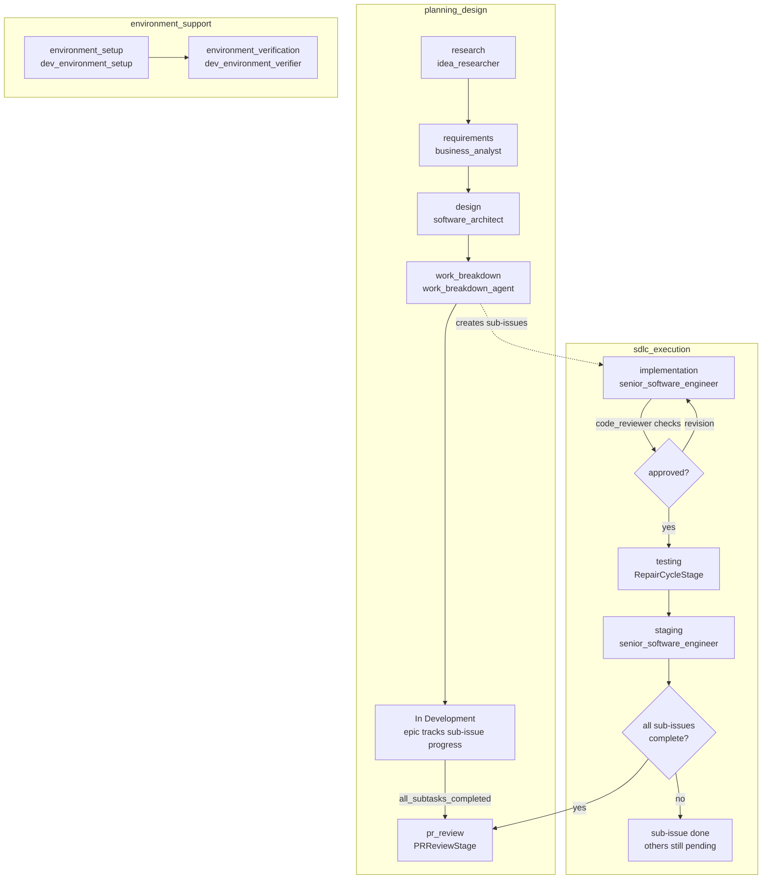
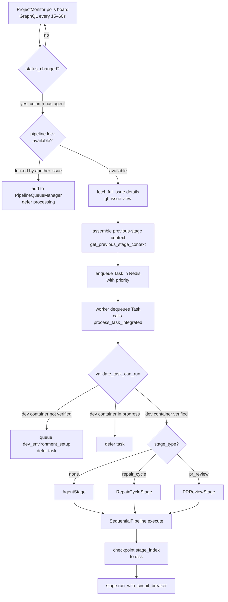
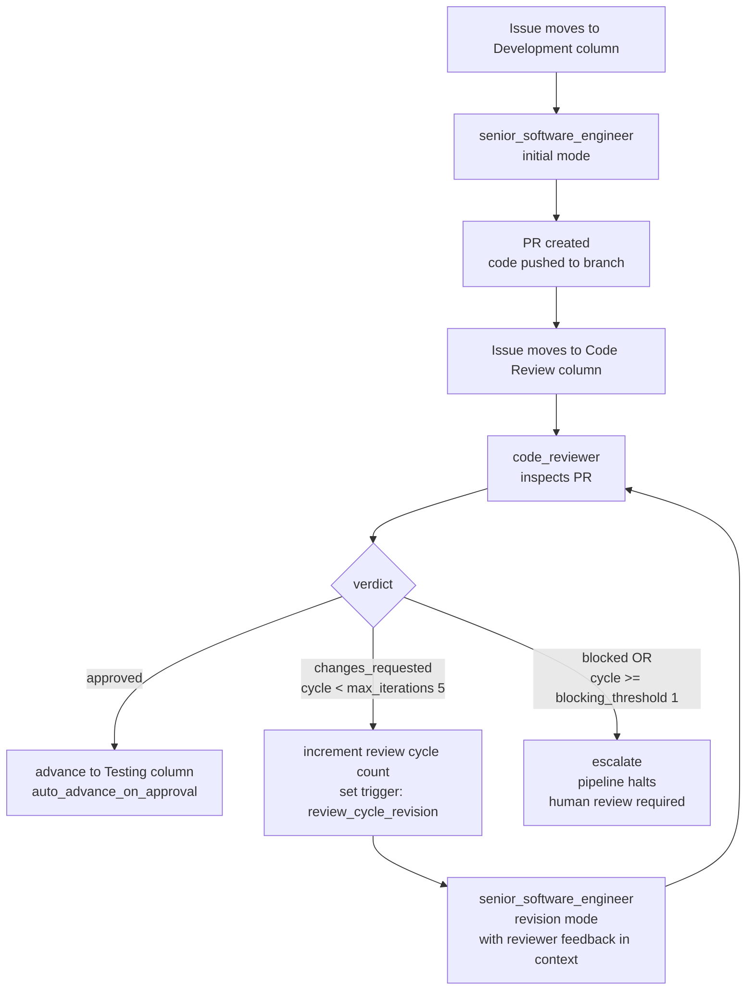
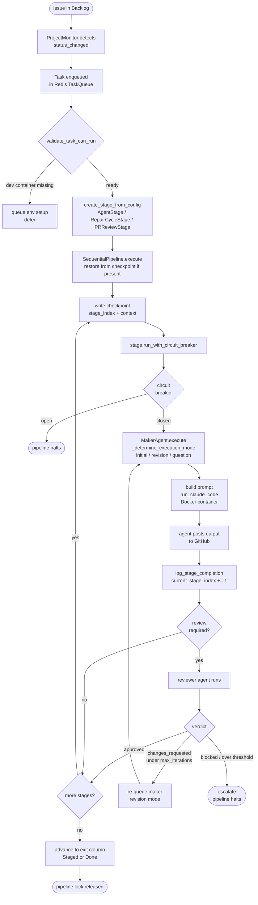
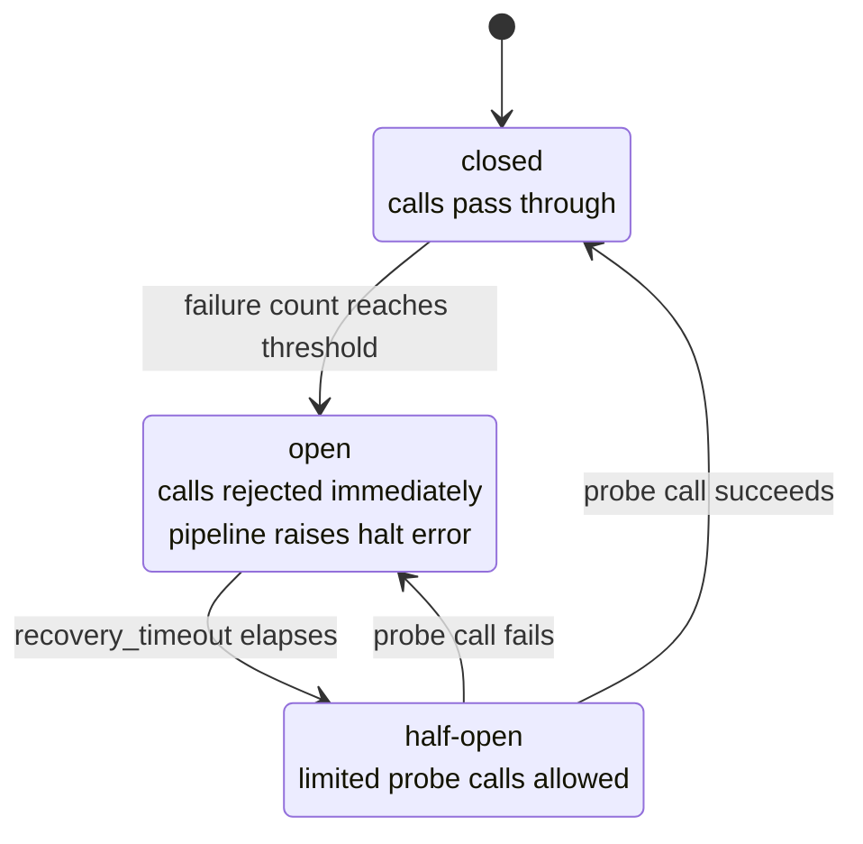

# Pipeline architecture

## Concepts: template, workflow, and pipeline run

A **pipeline template** (`config/foundations/pipelines.yaml`) defines a reusable sequence of stages. It specifies which agent runs at each stage, whether a reviewer follows that agent, and how many retries are allowed. Templates are abstract — they describe what happens, not to which issue or project.

A **workflow template** (`config/foundations/workflows.yaml`) defines the Kanban board structure that drives a pipeline. Each column in a workflow maps to a stage in the corresponding pipeline template. Moving an issue into a column is what triggers that stage to execute. A workflow also declares which columns signal "pipeline is active" (`pipeline_trigger_columns`) and which signal "pipeline is complete" (`pipeline_exit_columns`).

A **pipeline run** is a live execution of a pipeline template for a specific issue and project. It is created by `SequentialPipeline` in `pipeline/orchestrator.py` and assigned a `pipeline_id` at runtime. The run advances through stages sequentially, checkpointing before each stage and logging completion or failure after each one.

The three templates and the workflows that instantiate them:

| Template | Workflow | Trigger columns | Exit columns |
|---|---|---|---|
| `planning_design` | `planning_design_workflow` | `Research` | `In Development`, `Done` |
| `sdlc_execution` | `sdlc_execution_workflow` | `Development` | `Staged`, `Done` |
| `environment_support` | `environment_support_workflow` | `In Progress` | `Done` |



Projects reference templates and workflows in `config/projects/<project>.yaml`. The `PipelineFactory` in `pipeline/factory.py` instantiates a `SequentialPipeline` from a template by creating one `AgentStage` per stage (plus a reviewer stage where `review_required: true`).

---

## Pipeline templates

### planning_design

Handles pre-SDLC work for epics. Uses GitHub Discussions as its workspace (`workspace: discussions`, `discussion_category: Ideas`). Stages run sequentially; the first three are conversational (the board columns for these are `type: conversational`), meaning each supports multi-turn threaded Q&A between the agent and a human.

Stages in order:

1. **research** — `idea_researcher` performs market research and idea validation. No review required.
2. **requirements** — `business_analyst` produces business requirements analysis. No review required.
3. **design** — `software_architect` produces system architecture and design. No review required.
4. **work_breakdown** — `work_breakdown_agent` decomposes the epic into sub-issues using outputs from `business_analyst` and `software_architect` (`inputs_from`). No review required.
5. **pr_review** — `PRReviewStage` (`stage_type: pr_review`) orchestrates a multi-phase review of all PRs produced by sub-issues. Uses `pr_code_reviewer` for Phase 1 and `requirements_verifier` for Phase 2. No review required (the stage manages its own cycle logic internally).

### sdlc_execution

Handles implementation of individual sub-issues. Uses GitHub Issues as its workspace. Supports up to 5 review iterations between maker and checker.

Stages in order:

1. **implementation** — `senior_software_engineer` writes code. `review_required: true`; the reviewer is `code_reviewer` with up to 5 reviewer retries. A PR is required (`github_pr_required: true`). After one blocking review cycle, the issue escalates for human intervention.
2. **testing** — `RepairCycleStage` (`stage_type: repair_cycle`) runs deterministic test-fix-validate loops using `senior_software_engineer`. Test type configurations (types, max iterations, warning handling) are loaded from the project's `testing` config block. No separate reviewer; convergence is determined by test pass/fail. Circuit-breaker cap: `max_total_agent_calls: 100`. Checkpoints every 5 iterations.
3. **staging** — `senior_software_engineer` prepares the issue for production handoff. No review required. Manual human approval is needed before advancing to Done.

### environment_support

Handles Dockerfile and dependency issues. Uses GitHub Issues as its workspace.

Stages in order:

1. **environment_setup** — `dev_environment_setup` analyzes and repairs the environment configuration. No review required.
2. **environment_verification** — `dev_environment_verifier` validates that the Docker image built successfully. Takes input from `dev_environment_setup`. No review required.

---

## From issue detection to stage execution



### Detection

`ProjectMonitor` (`services/project_monitor.py`) polls every GitHub Projects v2 board every 15–60 seconds (adaptive backoff when idle). On each poll, `get_project_items()` queries the board via GraphQL. `detect_changes()` compares the result to `last_state` and emits a `status_changed` event when an issue moves to a new column.

### Task creation

When a status change lands the issue in a `pipeline_trigger_column` (e.g., `Development` in `sdlc_execution_workflow`), the monitor looks up the column's `stage_mapping` and `agent` from the workflow config, fetches full issue details via `gh issue view`, assembles previous-stage context from prior comments (`get_previous_stage_context()`), and enqueues a `Task` into the Redis-backed `TaskQueue`.

The task carries:
- `agent`: the agent name from the workflow column config
- `project`: project name
- `priority`: mapped from issue labels or defaulted
- `context`: issue object, issue number, board, repository, column, previous stage output, pipeline run ID, and (for repair cycles) test configurations

### Execution

The task worker dequeues the task and calls `create_stage_from_config()` (`agents/orchestrator_integration.py`), which inspects `stage_type` to instantiate the correct `PipelineStage` subclass:

- No `stage_type` → `AgentStage` wrapping the registered maker agent class
- `stage_type: repair_cycle` → `RepairCycleStage`
- `stage_type: pr_review` → `PRReviewStage`

`SequentialPipeline.execute()` then runs the stage. Before executing each stage, it creates a checkpoint. After successful execution, it logs completion and increments `current_stage_index`. On failure, it logs the error and checks whether the circuit breaker is open; if so, it raises and halts the pipeline.

---

## Stage execution model

### PipelineStage base class

Defined in `pipeline/base.py`. Abstract base with one required method: `execute(context) -> context`. Every stage is wrapped in a `CircuitBreaker` via `run_with_circuit_breaker()`. The circuit breaker opens after a configurable failure threshold and prevents further calls until a recovery timeout elapses.

`PipelineState` values: `IDLE`, `RUNNING`, `PAUSED`, `FAILED`, `COMPLETED`.

### MakerAgent

Defined in `agents/base_maker_agent.py`. Extends `PipelineStage`. All agents that produce output (analysis or code) inherit from `MakerAgent`. Subclasses must implement:
- `agent_display_name` — human-readable name
- `agent_role_description` — role description injected into prompts
- `output_sections` — list of section names used in revision prompts

`MakerAgent.execute()` calls `_determine_execution_mode()`, selects the appropriate prompt builder, and calls `run_claude_code()` with the assembled prompt and context. The result is stored in `context['markdown_analysis']` for downstream stages and GitHub posting.

### AnalysisAgent

Defined in `agents/base_analysis_agent.py`. Extends `MakerAgent`. Used for agents that produce markdown output posted to GitHub but never write files to the workspace. Defaults `makes_code_changes` and `filesystem_write_allowed` to `False` and overrides `_get_output_instructions()` to enforce strict no-file-creation rules.

Agents that extend `AnalysisAgent`: `business_analyst`, `idea_researcher`, `software_architect`, `work_breakdown_agent`.

Agents that extend `MakerAgent` directly (write files): `senior_software_engineer`, `technical_writer`, `dev_environment_setup`.

### The three execution modes

`_determine_execution_mode()` reads `task_context` and returns one of three strings:

**`initial`** — Default. Selected when none of the revision or question conditions are met. The agent receives the issue title, body, labels, and any previous stage output. Prompt instructs the agent to produce a complete first-time output.

**`revision`** — Selected when `trigger` is `review_cycle_revision` or `feedback_loop`, or when `revision` or `feedback` keys are present in the task context. The agent receives its previous output, the feedback to address, and the current review cycle count. The prompt requires the agent to produce a `## Revision Notes` checklist before the revised document. Targeted changes only; complete rewrites are explicitly prohibited.

**`question`** — Selected when `trigger` is `feedback_loop` AND `conversation_mode` is `threaded` AND `thread_history` is non-empty. The agent receives the full thread history and the latest question. The prompt constrains the response to answering only the latest question and prohibits regenerating the full prior report.

---

## Column-to-agent mapping

Each workflow column that triggers agent work carries three fields:

```yaml
stage_mapping: <stage name from pipeline template>
agent: <agent name>
automation_rules:
  - trigger: item_moved_to_column
    action: start_pipeline_stage | start_review_cycle | start_conversational_loop
    parameters:
      stage: <stage name>
```

The `stage_mapping` cross-references the pipeline template. The `agent` field is the default agent name; the task worker uses this to instantiate the stage. When a column's `action` is `start_review_cycle`, the worker also looks up `reviewer_agent` from the pipeline template's stage config (e.g., `code_reviewer` for the `implementation` stage).

Columns with `stage_mapping: null` (Backlog, Done, Staged) do not trigger agent work.

Full mapping across all three workflows:

**planning_design_workflow**

| Column | Stage | Agent | Action |
|---|---|---|---|
| Research | research | idea_researcher | start_conversational_loop |
| Requirements | requirements | business_analyst | start_conversational_loop |
| Design | design | software_architect | start_conversational_loop |
| Work Breakdown | work_breakdown | work_breakdown_agent | start_pipeline_stage |
| In Review | pr_review | pr_review_agent (PRReviewStage) | start_pipeline_stage |

**sdlc_execution_workflow**

| Column | Stage | Agent | Action |
|---|---|---|---|
| Development | implementation | senior_software_engineer | start_pipeline_stage |
| Code Review | implementation_review | code_reviewer (checks senior_software_engineer) | start_review_cycle |
| Testing | testing | senior_software_engineer (RepairCycleStage) | start_pipeline_stage |

**environment_support_workflow**

| Column | Stage | Agent | Action |
|---|---|---|---|
| In Progress | environment_setup | dev_environment_setup | start_pipeline_stage |
| Verification | environment_verification | dev_environment_verifier | start_pipeline_stage |

---

## Review cycles

### Maker-checker review (implementation stage)



When an issue moves to the `Code Review` column, the orchestrator starts a maker-checker loop between `senior_software_engineer` (maker) and `code_reviewer` (checker).

The `code_reviewer` inspects the PR and returns one of three verdicts: approved, changes requested, or blocked. On `changes_requested`, the orchestrator sets `trigger: review_cycle_revision` in the task context, increments the cycle counter, and re-queues the `senior_software_engineer` in `revision` mode. The revision prompt provides the reviewer's feedback and the previous output, and instructs the agent to produce targeted changes.

The cycle repeats up to `max_iterations: 5` (from the `Code Review` column config). If the `blocking_threshold` of 1 is reached and the reviewer still blocks, the issue is escalated — the pipeline halts and the issue stays in the current column for human review.

On approval (`auto_advance_on_approval: true`), the orchestrator advances the issue to the next column.

### PR review cycles (pr_review stage)

`PRReviewStage` manages its own independent cycle count, persisted in `state/projects/<project>/pr_review_state.yaml` via `PRReviewStateManager`.

The maximum is `MAX_REVIEW_CYCLES = 3` (defined in `pipeline/pr_review_stage.py`). The stage checks `pr_review_state_manager.get_review_count()` at the start of each execution. If the count equals or exceeds 3, it raises `NonRetryableAgentError` and halts.

Each execution runs three phases:

1. **Phase 1**: `pr_code_reviewer` reviews the PR diff for code quality issues. On cycles 2 and 3, the prior cycle's findings are injected into the reviewer's prompt.
2. **Phase 2**: `requirements_verifier` checks that the PR implementation satisfies the original requirements (up to 4 sub-invocations).
3. **Phase 3**: CI status check via `gh` CLI (no Docker container; runs in the orchestrator process).

If either agent finds actionable issues, `PRReviewStage` creates GitHub sub-issues for each finding and records them in the state manager via `increment_review_count()`. The sub-issues feed back into the `sdlc_execution` pipeline for the sub-issues to be addressed before the next review cycle.

The review count can be reset manually via `pr_review_state_manager.reset_review_count()`. Previous iteration history is preserved for audit purposes even after a reset.

### Conversational loops (Research, Requirements, Design columns)

Columns with `action: start_conversational_loop` support threaded Q&A. When a human comments in the thread after the agent's initial response, the monitor detects the comment, sets `trigger: feedback_loop`, `conversation_mode: threaded`, and populates `thread_history`. The agent runs in `question` mode and posts a reply scoped to the latest question only.

---

## Checkpointing and recovery

### SequentialPipeline checkpoints

Before each stage executes, `SequentialPipeline` calls `StateManager.checkpoint()`, which writes a JSON file to `orchestrator_data/state/checkpoints/<pipeline_id>_stage_<index>.json`. The checkpoint contains:

- `pipeline_id`
- `stage_index` (the index about to execute)
- `timestamp`
- `context` (serializable keys only; non-serializable objects such as `state_manager` and `logger` are skipped)

On `SequentialPipeline.execute()` startup, `get_latest_checkpoint()` scans for checkpoint files matching the pipeline ID and returns the one with the highest stage index. If found, execution resumes from that stage using the stored context rather than `initial_context`.

### Repair cycle checkpoints

`RepairCycleStage` uses a separate, more granular checkpoint system (`RepairCycleCheckpoint` in `pipeline/repair_cycle_checkpoint.py`). Checkpoints are written atomically every `checkpoint_interval` iterations (default 5) and on each test type completion.

Checkpoint location: `state/projects/<project>/repair_cycles/<issue_number>/checkpoint.json`

A backup copy is maintained at `checkpoint.backup.json`. On load, the primary file is tried first; if it fails JSON parsing, the backup is used. Version validation (`CHECKPOINT_VERSION = "1.0"`) rejects checkpoints from incompatible versions.

Checkpoint fields: `version`, `checkpoint_time`, `project`, `issue_number`, `pipeline_run_id`, `stage_name`, `test_type`, `test_type_index`, `iteration`, `agent_call_count`, `files_fixed`, `test_results`, `cycle_results`.

Checkpoints are cleared via `clear_checkpoint()` when the repair cycle completes successfully.

Repair cycle containers also register in Redis (`repair_cycle:container:<project>:<issue>`) with a 2-hour TTL so the orchestrator can detect and recover stalled containers on restart.

### Stall detection

`_is_repair_cycle_stalled()` queries Elasticsearch indices `decision-events-*`, `agent-events-*`, and `claude-streams-*` for the `pipeline_run_id`. If no events appear for 3600 seconds, the repair cycle is considered stalled. The function fails open (returns `False`) if Elasticsearch is unavailable, to prevent killing live cycles.

---

## State transitions: full pipeline run lifecycle

```
Issue created in Backlog
        |
        | (human moves issue to trigger column)
        v
ProjectMonitor detects status_changed
        |
        | enqueue Task
        v
TaskQueue (Redis)
        |
        | dequeue
        v
validate_task_can_run()
        |-- dev container not verified --> queue dev_environment_setup task, defer
        |-- dev container in progress  --> defer
        v (dev container verified)
create_stage_from_config()
        |-- standard stage   --> AgentStage
        |-- repair_cycle     --> RepairCycleStage
        |-- pr_review        --> PRReviewStage
        v
SequentialPipeline.execute()
        |
        +-- checkpoint (stage_index, context)
        |
        v
stage.run_with_circuit_breaker()
        |
        |-- circuit breaker OPEN --> raise, pipeline halts
        |
        v
MakerAgent.execute()
        |
        +-- _determine_execution_mode() --> initial | revision | question
        +-- build prompt
        +-- run_claude_code() --> Docker container (claude-agent-<project>-<task_id>)
        |
        v
Agent output posted to GitHub issue/discussion as comment
        |
        v
StateManager.log_stage_completion()
current_stage_index += 1
        |
        v
[review_required?]
        |-- yes --> reviewer agent runs --> approved / changes_requested / blocked
        |           approved    --> advance to next column
        |           changes_requested (under max_iterations) --> revision mode, re-queue maker
        |           blocked / over threshold --> escalate, halt pipeline
        |-- no  --> advance to next column via pipeline_progression
        |
        v
[more stages?]
        |-- yes --> loop back to checkpoint
        |-- no  --> pipeline complete
        |
        v
Issue moved to exit column (Staged or Done)
Pipeline lock released
```



### Circuit breaker states



Each `PipelineStage` holds a `CircuitBreaker` instance. States:

- **closed** (normal): calls pass through
- **open** (tripped): calls rejected immediately; pipeline raises `"Pipeline halted: <stage> circuit breaker open"`
- **half-open** (recovering): after `recovery_timeout` seconds, limited calls allowed; success returns to closed, failure re-opens

The `RepairCycleStage` has an additional application-level circuit breaker: `max_total_agent_calls` (default 100). When the `_agent_call_count` reaches this limit, the stage returns its current result without raising, to prevent unbounded cost accumulation.

`PRReviewStage` has an equivalent cap: `max_agent_calls` (default 20).

### Pipeline run ID

Every pipeline run is tagged with a `pipeline_run_id` UUID assigned when the task is first enqueued. This ID propagates through all observability events, checkpoint files, Redis keys, and Docker container launches, enabling end-to-end tracing of a single issue's execution history.
