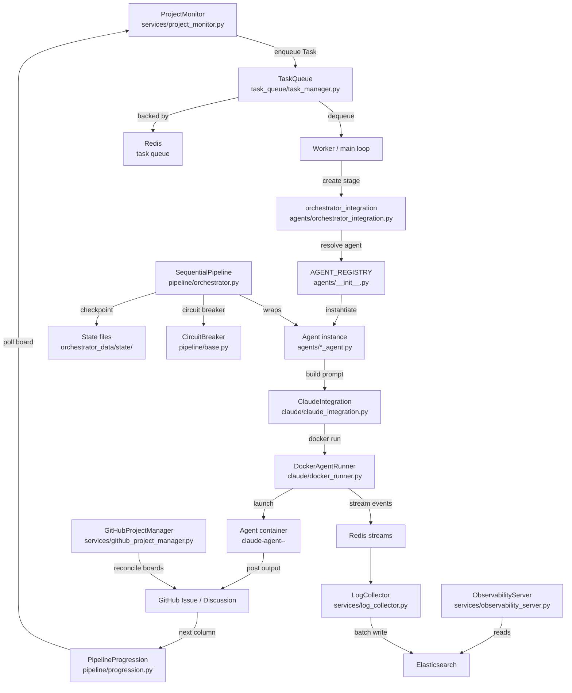
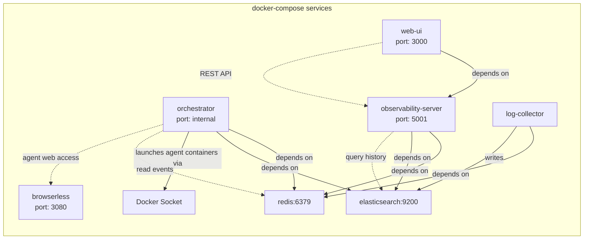
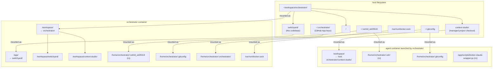
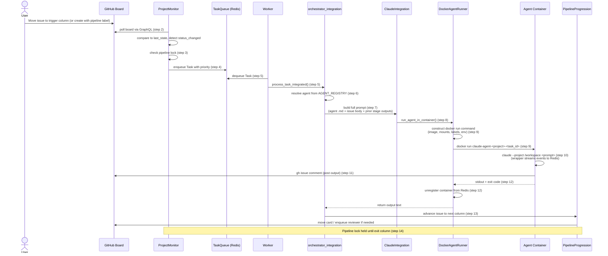

# Switchyard system architecture

Switchyard is an autonomous AI development orchestrator. It monitors GitHub Projects v2 Kanban boards, detects when issues move between columns, and dispatches specialized AI agents to execute the corresponding work. Each agent runs as an isolated Docker container, executes Claude Code against a cloned project workspace, posts its output as GitHub issue comments, and the orchestrator then advances the issue to the next pipeline column. The result is a fully automated SDLC loop driven by board state changes.

The system targets teams that want to hand off entire development workflows — requirements analysis, architecture, implementation, review, documentation — to autonomous agents while retaining GitHub as the authoritative interface for control and visibility.

---

## Component map



### Entry point: `main.py`

`main.py` is the async entry point. On startup it performs the following sequence in order:

1. Registers a SIGCHLD handler to reap zombie child processes from git and Docker subprocess calls.
2. Initializes the task queue (Redis-backed, in-memory fallback), state manager, health monitor, and `GitHubProjectManager`.
3. Initializes all project workspaces via `ProjectWorkspaceManager`.
4. Waits for Elasticsearch to pass a cluster health check (up to 60 seconds, 30 retries at 2-second intervals).
5. Recovers or kills orphaned agent containers from any previous run.
6. Syncs persisted pipeline locks from YAML to Redis and re-triggers agents for issues that were mid-execution when the orchestrator last stopped.
7. Cleans up stale `in_progress` execution states and orphaned Redis keys.
8. Reconciles GitHub project boards for all visible projects via `GitHubProjectManager`.
9. Starts `ProjectMonitor` in a background daemon thread.
10. Starts the scheduled tasks service.
11. Waits for `ProjectMonitor` to complete its startup rescan before initializing the worker pool. This ordering is deliberate: repair cycles queued during the rescan must be in Redis before workers begin dequeuing.
12. Cleans up stale active pipeline runs and stale agent events in Elasticsearch.
13. Starts the worker pool (single-threaded or multi-worker, controlled by `ORCHESTRATOR_WORKERS`).
14. Enters the main loop: periodic health checks plus task dequeue-and-dispatch (single-threaded mode) or health monitoring only (multi-worker mode).

### `services/project_monitor.py` — `ProjectMonitor`

The polling engine. Runs in a dedicated daemon thread. On each cycle it queries all GitHub Projects v2 boards for all visible projects, compares current item statuses against the last known state, and enqueues tasks for any issue whose column has changed to a column that has an assigned agent.

Polling uses adaptive backoff: the interval starts at the project-configured value (default 15-30 seconds), doubles after 4 consecutive idle cycles (no state changes detected), and resets to the base interval on any activity. Maximum interval is 60 seconds.

The startup rescan runs once before the main loop begins. It signals `rescan_complete` when done, which `main.py` waits on before starting workers.

Board queries go through `execute_board_query_cached()` in `services/github_owner_utils.py`, which caches GraphQL responses with a short TTL to avoid duplicate API calls when multiple callers check the same board within the same polling cycle.

### `services/github_project_manager.py` — `GitHubProjectManager`

Reconciles the desired board configuration (from `config/foundations/workflows.yaml` and `config/projects/<project>.yaml`) against the actual state of GitHub Projects v2. On startup it creates missing boards, adds missing columns, creates repository labels (`pipeline:dev`, `pipeline:epic`), and writes discovered board IDs and column IDs to `state/projects/<project>/github_state.yaml`.

### `task_queue/task_manager.py` — `TaskQueue`

A priority queue with three levels: HIGH, MEDIUM, LOW. Tasks are `Task` dataclass instances identified by UUID. The primary backend is Redis; the in-memory `queue.PriorityQueue` is the fallback when Redis is unavailable.

Redis representation: each task is stored as a hash at `task:<id>` and its ID is pushed onto the list `tasks:high`, `tasks:medium`, or `tasks:low`. Dequeue iterates from HIGH to LOW, popping the tail of each list. Tasks with a `not_before` timestamp in the future are pushed back to the head and skipped; the scan stops after inspecting at most `llen(queue)` items per dequeue call to prevent an infinite loop.

### `agents/` — agent classes

Twelve agents are registered in `AGENT_REGISTRY`:

| Name | Role |
|---|---|
| `dev_environment_setup` | Generates `Dockerfile.agent` for the project |
| `dev_environment_verifier` | Validates the agent Docker image |
| `idea_researcher` | Researches and expands requirements |
| `business_analyst` | Produces business requirements documents |
| `software_architect` | Produces architecture and design documents |
| `work_breakdown_agent` | Decomposes epics into GitHub issues |
| `senior_software_engineer` | Implements features and bug fixes |
| `code_reviewer` | Reviews code against requirements |
| `technical_writer` | Produces technical documentation |
| `documentation_editor` | Edits and refines documentation |
| `pr_code_reviewer` | Reviews pull requests for code quality |
| `requirements_verifier` | Verifies implementation against requirements |

All agents extend either `MakerAgent` (produces output: code, documents, comments) or `AnalysisAgent` (analysis-only, extends `MakerAgent`). Both extend `PipelineStage`, which is the base class defined in `pipeline/base.py`.

Every `MakerAgent` supports three execution modes determined from task context at runtime:
- **Initial**: First execution for a new issue.
- **Revision**: Re-execution triggered by reviewer feedback (`trigger: 'review_cycle_revision'`).
- **Question**: Conversational reply triggered by a feedback loop comment (`trigger: 'feedback_loop'` with `conversation_mode: 'threaded'`).

### `pipeline/orchestrator.py` — `SequentialPipeline`

Executes a list of `PipelineStage` instances in order. Before each stage it writes a checkpoint to `orchestrator_data/state/checkpoints/<pipeline_id>_stage_<n>.json`. If a checkpoint exists when `execute()` is called, the pipeline resumes from the saved stage index. After each stage succeeds it logs the completion event. If a stage raises and the circuit breaker is open, the pipeline halts.

### `claude/docker_runner.py` — `DockerAgentRunner`

Constructs and executes the `docker run` command that launches each agent container. Responsibilities:

- Translates container-internal paths (`/workspace/<project>`) to host-side paths using `/proc/self/mountinfo` (with `HOST_HOME` environment variable override for Snap Docker compatibility).
- Determines workspace mount mode (read-write or read-only) from the agent's `filesystem_write_allowed` configuration flag.
- Applies Docker labels (`org.switchyard.project`, `org.switchyard.agent`, `org.switchyard.issue_number`, `org.switchyard.pipeline_run_id`, `org.switchyard.managed=true`) to every container so recovery logic can identify containers without parsing names or querying Redis.
- Registers active containers in Redis at `agent:container:<container_name>` with a TTL, enabling recovery after an orchestrator restart.
- Detects and blocks execution when the Claude Code circuit breaker is open.
- Cleans up the container and Redis registration in a `finally` block.
- Passes the prompt to the container via stdin to avoid command-line length limits.

Container names follow the pattern `claude-agent-<project>-<task_id>`. Repair cycle containers follow `repair-cycle-<project>-<issue>-<run_id[:8]>`.

### `services/observability_server.py` — observability server

A Flask process that runs as a separate Docker Compose service on port 5001. It exposes a REST API consumed by the web UI and available for direct querying. Key endpoints:

- `GET /health` — Redis, GitHub, and Docker connectivity
- `GET /agents/active` — currently running agent containers
- `GET /history` — agent execution history from Elasticsearch
- `GET /active-pipeline-runs` — pipeline runs currently in progress
- `GET /api/circuit-breakers` — circuit breaker states
- `POST /agents/kill/<container_name>` — kill a running agent

### `services/log_collector.py` — log collector

A separate Docker Compose service that reads structured log events from a Redis stream and writes them to Elasticsearch in batches. Batch size and timeout are configurable (`LOG_BATCH_SIZE`, `LOG_BATCH_TIMEOUT`).

---

## Runtime environment

### Docker Compose services



| Service | Image | Port | Role |
|---|---|---|---|
| `orchestrator` | Built from `./Dockerfile` | — | Main process; runs `main.py` |
| `observability-server` | Same image | 5001 | REST API for web UI and monitoring |
| `web-ui` | Built from `./web_ui/` | 3000 | React dashboard |
| `log-collector` | Same image | — | Redis-to-Elasticsearch log pipeline |
| `redis` | `redis:7-alpine` | 6379 | Task queue, container registry, event streams |
| `elasticsearch` | `elasticsearch:9.0.0` | 9200 | Event storage, metrics, log search |
| `browserless` | `ghcr.io/browserless/chromium` | 3080 | Headless browser for agents that need web access |

All services share the `orchestrator-net` bridge network. Services communicate by hostname (e.g., `redis:6379`, `elasticsearch:9200`).

The `orchestrator` service depends on `redis` (started) and `elasticsearch` (healthy). The `observability-server` service has the same dependencies. The web UI depends on the observability server.

The orchestrator and observability server are built from the same image. The image is also used as the base for repair cycle containers launched by the orchestrator at runtime.

### Service startup ordering

`main.py` explicitly waits for Elasticsearch with a retry loop rather than relying on `depends_on: condition: service_healthy` alone. This is because the health condition covers the Docker health check but not the moment when indices are ready to accept writes.

---

## Workspace isolation model

### Host directory layout



The host filesystem has a parent `orchestrator/` directory that contains both the switchyard codebase and managed project checkouts:

```
~/workspace/orchestrator/        # Host parent directory
├── switchyard/                  # This codebase
└── <project-name>/              # Cloned project workspaces (e.g., context-studio/)
```

### Volume mounts in the orchestrator container

```
/app/                        <- host switchyard/          (read-write, live code)
/workspace/                  <- host orchestrator/        (read-write, workspace root)
  ├── switchyard/            <- same as /app
  └── <project-name>/        <- managed project checkouts
/home/orchestrator/.ssh/id_ed25519  <- host ~/.ssh/id_ed25519  (read-only)
/home/orchestrator/.gitconfig       <- host ~/.gitconfig
/home/orchestrator/.orchestrator/   <- host ~/.orchestrator/   (GitHub App keys)
/var/run/docker.sock                <- host Docker socket
```

### Why the boundary exists

The `..:/workspace` mount exposes only the `orchestrator/` parent, not the user's entire home directory. A sibling project directory at `~/workspace/other-project/` is not visible inside the container. This prevents agents from accidentally reading or modifying unrelated codebases on the host.

The Docker socket mount is required for Docker-in-Docker: the orchestrator container must be able to call `docker run` to launch agent containers. Those agent containers are siblings on the host Docker daemon, not children of the orchestrator container. The orchestrator runs in rootful Docker mode because rootless Docker-in-Docker is not yet stable.

### Agent container mounts

When `DockerAgentRunner` launches an agent container, it constructs host-side paths from the container-internal `/workspace/<project>` path using `/proc/self/mountinfo`. The agent container receives:

```
/workspace/              <- host orchestrator/<project>/   (rw or ro per agent config)
/home/orchestrator/.ssh/ <- host ~/.ssh/                   (read-only)
/home/orchestrator/.gitconfig  <- host ~/.gitconfig
/app/scripts/docker-claude-wrapper.py  <- wrapper script  (read-only)
```

The `HOST_HOME` environment variable must be set explicitly in `.env` when running under Snap Docker. Snap Docker remaps the user's home directory through a versioned path (`/home/user/snap/docker/<rev>/`) that lacks SSH config and known_hosts, breaking git operations inside agent containers.

---

## Agent execution model

### Step-by-step flow from GitHub issue to agent output



1. A user moves a GitHub issue to a trigger column on the project board, or creates an issue with a `pipeline:dev` or `pipeline:epic` label.

2. `ProjectMonitor.monitor_projects()` polls the board (via `get_project_items()`, GraphQL API). It compares the current item status against `self.last_state`. A changed or new status in a column that has an assigned agent triggers task creation.

3. `ProjectMonitor` checks the pipeline lock for the project/board. Each pipeline board has at most one active issue at a time. If a lock is held by another issue, the new issue is added to the pipeline queue managed by `PipelineQueueManager` and processing stops.

4. If the lock is available (or this issue holds it), a `Task` is enqueued in `TaskQueue`. Priority is determined by the agent type and context (PR reviews are HIGH; development tasks are MEDIUM; documentation is LOW).

5. The main loop (or a worker in the worker pool) dequeues the task and calls `process_task_integrated()` from `agents/orchestrator_integration.py`.

6. `process_task_integrated` resolves the agent class from `AGENT_REGISTRY`, constructs the agent instance, and calls its `execute()` method.

7. The agent's `execute()` calls `claude/claude_integration.py` to build the full prompt. The prompt assembles: the agent's instruction file from `.claude/agents/<agent-name>.md`, the issue body and comments, prior stage outputs, and any task-specific context (PR diff, test results, etc.).

8. `ClaudeIntegration` calls `DockerAgentRunner.run_agent_in_container()`.

9. `DockerAgentRunner` builds the `docker run` command:
   - Container name: `claude-agent-<project>-<task_id>`
   - Image: the project's `<project>-agent` image (built from `Dockerfile.agent` by `dev_environment_setup`)
   - Workspace mount: host path to the project directory (read-write or read-only)
   - SSH and git config mounts
   - Labels: project, agent, task_id, issue_number, pipeline_run_id
   - Environment: `ANTHROPIC_API_KEY`, `CLAUDE_CODE_OAUTH_TOKEN`, `GITHUB_TOKEN`, Redis URL, Elasticsearch host
   - Command: the `claude` CLI with the prompt passed via stdin

10. The container runs `claude --project /workspace <prompt>` using Claude Code's agent mode. The agent uses tools (file read/write, bash, gh CLI, git) to accomplish its task. As it runs, the wrapper script (`scripts/docker-claude-wrapper.py`) writes streaming events to a Redis stream for real-time observability.

11. On completion, the agent posts its output as a comment on the GitHub issue using `gh issue comment`.

12. `DockerAgentRunner` collects stdout, unregisters the container from Redis, and returns the output text.

13. The pipeline advances the issue to the next column via `pipeline/progression.py`. If the next column is a review column, the reviewer agent's task is enqueued.

14. The pipeline lock remains held by the issue until it reaches an exit column (e.g., Done, Closed) or is removed from the board.

### Maker-checker pattern

Pipelines pair maker agents with checker agents. For example, in `sdlc_execution`: `senior_software_engineer` (maker) is followed by `code_reviewer` (checker), and `code_reviewer` by `requirements_verifier`. If a checker finds problems, it posts feedback to the issue and the orchestrator triggers a revision cycle, re-running the maker agent in Revision mode with the reviewer's comments in context.

### Repair cycles

When code changes fail tests, the orchestrator launches a repair cycle as a separate Docker container running `pipeline/repair_cycle_runner.py`. The repair cycle container uses the orchestrator image (not the project agent image) and spawns inner agent containers (using the project agent image) to iteratively fix the failing tests. Results are written to Redis at `repair_cycle:result:<project>:<issue>:<run_id>`.

---

## Data stores

### Redis

Redis is the primary operational data store. It is used for:

- **Task queue**: Lists `tasks:high`, `tasks:medium`, `tasks:low` contain task IDs. Each task is stored as a hash at `task:<id>`.
- **Active container registry**: Each running agent container is registered at `agent:container:<container_name>` as a hash with fields `container_name`, `project`, `agent`, `task_id`, `pipeline_run_id`, `started_at`. TTL is 2 hours. Used by recovery logic on startup.
- **Repair cycle container registry**: `repair_cycle:container:<project>:<issue>` maps to the container name. TTL is 2 hours.
- **Repair cycle results**: `repair_cycle:result:<project>:<issue>:<run_id>` stores the JSON result from a completed repair cycle.
- **Pipeline locks**: `pipeline_lock:<project>:<board>` stores lock state (locked/unlocked, current lock holder, timestamp). The YAML backup is at `state/pipeline_locks/<project>_<board>.yaml`.
- **Pipeline queue**: Issue numbers waiting for the pipeline lock are stored in YAML at `state/pipeline_queues/<project>_<board>.yaml`, not in Redis.
- **Claude log streams**: Real-time Claude Code output is written to Redis streams by the wrapper script for the observability server to broadcast via WebSocket.
- **Health state**: The health monitor writes system health status to a Redis key with a 10-minute TTL.
- **Work execution state**: Tracked in YAML at `state/execution_history/<project>_issue_<number>.yaml` by `WorkExecutionStateTracker`. Not stored in Redis.

If Redis is unavailable on startup, `TaskQueue` falls back to in-memory queues. All other Redis-dependent features degrade gracefully with log warnings.

### Elasticsearch

Elasticsearch is used for durable event storage and metrics. The orchestrator waits for Elasticsearch to be healthy before completing startup.

**Indices:**

| Index pattern | Content |
|---|---|
| `agent-events-YYYY.MM.DD` | Agent lifecycle events (start, complete, fail) |
| `decision-events-YYYY.MM.DD` | Pipeline routing decisions and trigger events |
| `claude-streams-YYYY.MM.DD` | Streaming Claude Code output per pipeline run |
| `orchestrator-task-metrics-YYYY.MM.DD` | Task duration, agent name, success/failure |
| `orchestrator-quality-metrics-YYYY.MM.DD` | Quality scores by agent and metric name |

The `log-collector` service consumes events from a Redis stream and writes them to Elasticsearch in batches. The observability server reads from Elasticsearch to serve the `/history` and `/claude-logs-history` endpoints.

Stall detection for repair cycles queries `decision-events-*`, `agent-events-*`, and `claude-streams-*` for the most recent event matching a `pipeline_run_id`. If no event has appeared in 3600 seconds, the repair cycle is considered stalled and the container is killed.

### State files

State files are YAML or JSON documents written to disk under `orchestrator_data/` and `state/`. They provide persistence across restarts for data that is impractical to reconstruct from GitHub or Redis.

| Path | Format | Content |
|---|---|---|
| `state/projects/<project>/github_state.yaml` | YAML | Board IDs, column IDs, last reconciliation timestamp |
| `state/projects/<project>/pr_review_state.yaml` | YAML | PR review cycle counts per issue |
| `state/dev_containers/<project>.yaml` | YAML | Whether the project's agent Docker image has been verified |
| `state/pipeline_locks/<project>_<board>.yaml` | YAML | Pipeline lock state (YAML-persisted mirror of Redis locks); flat files, not per-project subdirectories |
| `state/pipeline_queues/<project>_<board>.yaml` | YAML | Issues queued behind the pipeline lock |
| `state/execution_history/<project>_issue_<number>.yaml` | YAML | Work execution state per issue (prevents double-triggers) |
| `orchestrator_data/state/checkpoints/<pipeline_id>_stage_<n>.json` | JSON | Pipeline execution checkpoint at a given stage |
| `orchestrator_data/repair_cycles/<project>/<issue>/context.json` | JSON | Repair cycle context passed into the repair cycle container |

`state/` files are auto-managed by the orchestrator and should not be edited manually. The `orchestrator_data/` directory is runtime scratch space.

---

## Key design patterns

### Circuit breaker

A circuit breaker wraps external calls to GitHub and the Claude Code API. When a call fails, the breaker records the failure. After a threshold of consecutive failures the breaker opens, and subsequent calls fail immediately without attempting the external request. After a reset timeout the breaker moves to half-open and allows a probe request. On success it closes.

The GitHub circuit breaker is checked before every board reconciliation, before every GitHub API call in the monitoring loop, and before enqueuing tasks. The Claude Code breaker is checked inside `DockerAgentRunner` before launching each agent container.

Circuit breaker states are readable at `GET /api/circuit-breakers` on the observability server.

### Checkpointing

Before executing each stage of a `SequentialPipeline`, a JSON checkpoint is written to disk at `orchestrator_data/state/checkpoints/<pipeline_id>_stage_<n>.json`. If the orchestrator is interrupted mid-pipeline and the same pipeline is re-triggered, `SequentialPipeline.execute()` loads the latest checkpoint and resumes from the saved stage index.

### Pipeline locking

Each project board allows at most one active issue to hold the pipeline lock at a time. The lock is stored in Redis with YAML backup (`state/pipeline_locks/`). Issues that arrive while the lock is held are enqueued in the pipeline queue. On startup, lock recovery syncs YAML state to Redis (the canonical source of truth), then evaluates each held lock against Docker to determine whether the holding issue's agent is still running. Locks held by issues in exit columns or with no running container are released; issues still in an active column with a missing container are re-triggered.

The YAML backup exists specifically to survive Redis restarts. The startup sequence always syncs YAML to Redis before taking any action on existing locks.

### Maker-checker quality loop

Every pipeline stage that produces output is followed by one or more checker stages. Checkers evaluate the output against requirements and post structured feedback. The orchestrator detects a checker's rejection by checking the issue's column after progression and increments the review cycle count tracked in `state/projects/<project>/pr_review_state.yaml`. The maker is re-invoked in Revision mode with the checker's comments. This loop repeats up to a configured maximum before escalating or failing.

### Adaptive polling with backoff

`ProjectMonitor` avoids unnecessary GitHub API calls by doubling the poll interval after several consecutive idle cycles. Any detected board change resets the interval to the base value. This keeps the system responsive when active while reducing API consumption during quiet periods.

---

## Configuration layers

Configuration is organized into three layers that are read and merged at runtime.

**Foundations** (`config/foundations/`) are shared definitions applied to all projects:
- `agents.yaml` — agent capabilities, timeouts, Docker requirements, model selection
- `pipelines.yaml` — pipeline templates defining stage sequences and review rules
- `workflows.yaml` — Kanban board column definitions and column-to-agent mappings

**Projects** (`config/projects/<project>.yaml`) are per-project overrides:
- GitHub org, repo, repo URL
- Tech stack description passed to agents as context
- Which pipeline templates are enabled

**State** (`state/projects/<project>/`) is runtime state written by the orchestrator:
- GitHub board IDs, column IDs
- PR review cycle counts

Modifying foundations or project configs triggers re-reconciliation on next startup (detected via a config hash comparison in `github_state.yaml`).
