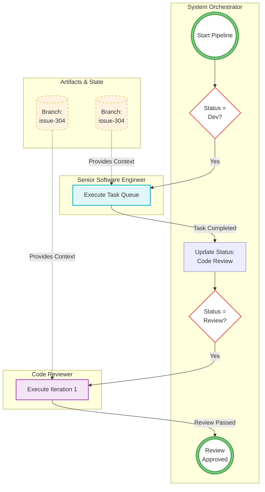

## BPMN Diagram
BPMN diagrams for the example graph data. The first diagram illustrates the high-level flow of the pipeline, while the second diagram provides a more detailed view of the review and repair cycles, including iterations and test executions.

## Flowchart Diagram
A more detailed flowchart that captures the iterative nature of the review and repair cycles, including the selection of reviewers, execution of tests, and the progression of status through various stages.

```mermaid
graph TD
    %% Styling Classes
    classDef default fill:#f4f5f7,stroke:#a5b0c2,stroke-width:1px,color:#2f3640;
    classDef startEnd fill:#2ecc71,stroke:#27ae60,stroke-width:2px,color:#fff,font-weight:bold;
    classDef agentExec fill:#00d2d3,stroke:#01a3a4,stroke-width:4px,color:#fff,font-weight:bold;
    classDef branch fill:#dfe4ea,stroke:#ced6e0,stroke-width:1px;
    classDef cycleBoundary fill:#f1f2f6,stroke:#7bed9f,stroke-width:2px,stroke-dasharray: 5 5;
    classDef repairBoundary fill:#fff2cc,stroke:#ffa502,stroke-width:2px,stroke-dasharray: 5 5;
    classDef subCycle fill:#ffffff,stroke:#dfe4ea,stroke-width:1px;

    %% --- Prelude ---
    Start([Pipeline Started<br/>SDLC Execution]):::startEnd --> Route1

    Route1[Agent Routing Decision<br/>Development ➔ Senior Software Engineer] --> Branch1
    Branch1[Branch Reused<br/>feature/issue-304]:::branch --> Agent1

    Agent1{{"👤 SENIOR SOFTWARE ENGINEER<br/>(Task Completed)"}}:::agentExec --> StatusProg

    StatusProg[Status Progression<br/>Development ➔ Code Review] --> Route2
    Route2[Agent Routing Decision<br/>Code Review ➔ Code Reviewer] --> RevStart

    %% --- Review Cycle ---
    subgraph Review_Cycle [Review Cycle]
        direction TB
        RevStart([Review Cycle Started]):::startEnd --> Iteration1

        subgraph Review_Iteration [Iteration 1 of 5]
            Iteration1[Reviewer Selected<br/>Code Reviewer] --> Branch2
            Branch2[Branch Reused]:::branch --> Agent2
            Agent2{{"👤 CODE REVIEWER<br/>(Task Completed)"}}:::agentExec
        end

        Agent2 --> RevEnd([Review Cycle Completed<br/>Status: Approved]):::startEnd
    end
    class Review_Cycle cycleBoundary;

    RevEnd --> RepStart

    %% --- Repair Cycle ---
    subgraph Repair_Cycle [Repair Cycle]
        direction TB
        RepStart([Repair Cycle Started]):::startEnd --> PC_Start

        %% Pre-commit Tests Sub-cycle
        subgraph Pre_Commit [Pre-commit Tests]
            direction TB
            PC_Start[Test Cycle Started] --> PC_ExecStart

            subgraph PC_Exec [Test Execution 1]
                PC_ExecStart[Test Execution Started] --> Agent3
                Agent3{{"👤 SENIOR SOFTWARE ENGINEER<br/>(Task Completed)"}}:::agentExec --> PC_ExecEnd
                PC_ExecEnd[Test Execution Completed<br/>Passed: 13 / Failed: 0]
            end

            PC_ExecEnd --> PC_End[Test Cycle Completed]
        end

        PC_End --> UT_Start

        %% Unit Tests Sub-cycle
        subgraph Unit_Tests [Unit Tests]
            direction TB
            UT_Start[Test Cycle Started] --> UT_ExecStart

            subgraph UT_Exec [Test Execution 1]
                UT_ExecStart[Test Execution Started] --> Agent4
                Agent4{{"👤 SENIOR SOFTWARE ENGINEER<br/>(Running 🔄)"}}:::agentExec
            end
        end
    end
    class Repair_Cycle repairBoundary;
    class Pre_Commit,Unit_Tests,Review_Iteration,PC_Exec,UT_Exec subCycle;
```

